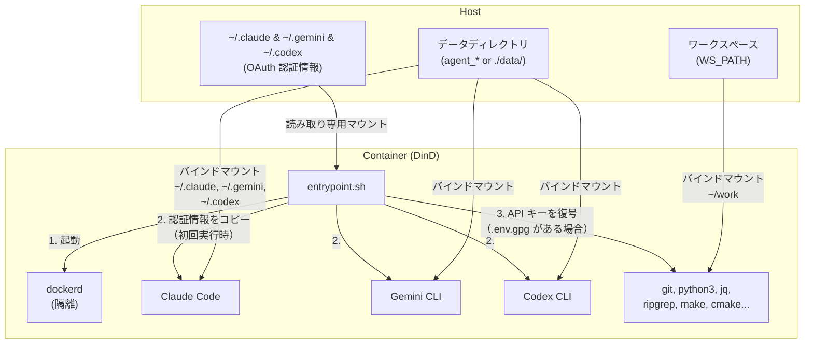
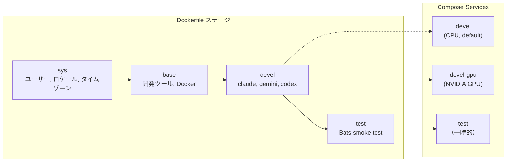
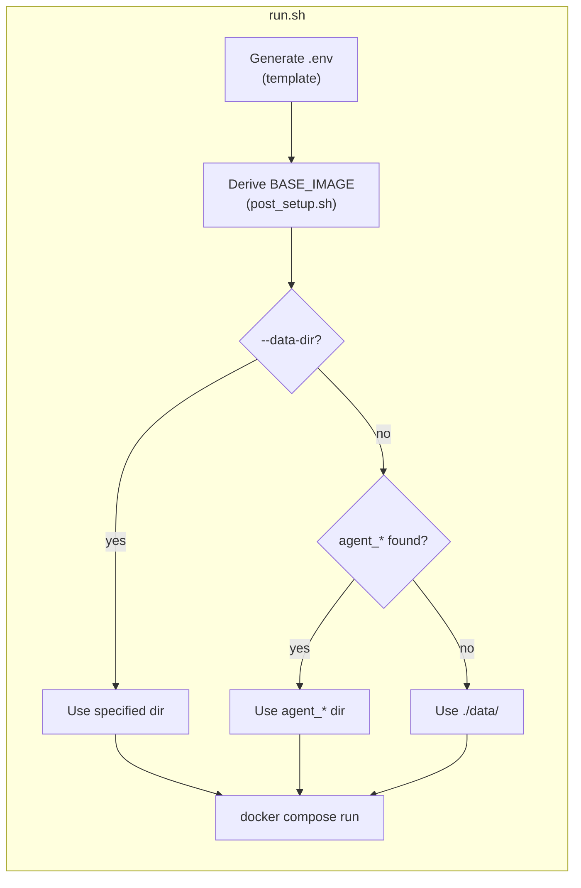

**[English](../README.md)** | **[繁體中文](README.zh-TW.md)** | **[简体中文](README.zh-CN.md)** | **日本語**

# AI Agent 開発環境

Docker-in-Docker (DinD) AI エージェント開発コンテナ。Claude Code、Gemini CLI、OpenAI Codex CLI がプリインストールされています。CPU と NVIDIA GPU の2つのバリアントを提供し、非 root ユーザーで実行され、ホストの UID/GID を自動的にマッチングします。

## 目次

- [TL;DR](#tldr)
- [概要](#概要)
- [前提条件](#前提条件)
- [クイックスタート](#クイックスタート)
- [会話の永続化](#会話の永続化)
- [複数インスタンスの実行](#複数インスタンスの実行)
- [認証](#認証)
  - [OAuth（対話式ログイン）](#oauth対話式ログイン)
  - [API キー（暗号化）](#api-キー暗号化)
- [Subtree としての利用](#subtree-としての利用)
- [設定](#設定)
- [Smoke Tests](#smoke-tests)
- [アーキテクチャ](#アーキテクチャ)
  - [Dockerfile ビルドステージ](#dockerfile-ビルドステージ)
  - [Compose サービス](#compose-サービス)
  - [エントリポイントフロー](#エントリポイントフロー)
  - [プリインストール済みツール](#プリインストール済みツール)
  - [コンテナ権限](#コンテナ権限)

## TL;DR

```bash
./build.sh && ./run.sh    # ビルドして起動（CPU、デフォルト）
```

- Claude Code + Gemini CLI + OpenAI Codex CLI を含む隔離された Docker-in-Docker コンテナ
- 非 root ユーザー、ホストから UID/GID を自動検出
- 初回実行時に OAuth 認証情報を自動コピー、会話履歴はローカルに永続化
- GPG AES-256 による API キーの暗号化（オプション）
- デフォルトは CPU バリアント、GPU バリアントは `./run.sh devel-gpu` を使用

## 概要







## 前提条件

- Docker（Compose V2 対応）
- GPU バリアントには [nvidia-container-toolkit](https://docs.nvidia.com/datacenter/cloud-native/container-toolkit/install-guide.html) が必要
- ホスト側で Claude Code（`claude`）、Gemini CLI（`gemini`）、Codex CLI（`codex`）の OAuth ログインを完了していること

## クイックスタート

```bash
# ビルド（実行のたびに .env を自動生成）
./build.sh              # CPU バリアント（デフォルト）
./build.sh devel-gpu    # GPU バリアント
./build.sh --no-env test  # ビルドのみ、.env 更新なし

# 起動
./run.sh                          # CPU バリアント（デフォルト）
./run.sh devel-gpu                # GPU バリアント
./run.sh --data-dir ../agent_foo  # データディレクトリを指定
./run.sh --no-env -d              # バックグラウンド起動、.env 更新をスキップ

# 実行中のコンテナに入る
./exec.sh
```

## 会話の永続化

会話履歴と Session データは バインドマウント により永続化され、コンテナ再起動後も保持されます。

`run.sh` はプロジェクトディレクトリから上方向に `agent_*` ディレクトリを自動スキャンします。見つかった場合はそのディレクトリにデータを保存し、見つからない場合は `./data/` にフォールバックします。

```
# 例：../agent_myproject/ が存在する場合
../agent_myproject/
├── .claude/    # Claude Code の会話履歴、設定、Session
├── .gemini/    # Gemini CLI の会話履歴、設定、Session
└── .codex/     # Codex CLI の会話履歴、設定、Session

# フォールバック：agent_* ディレクトリが見つからない場合
./data/
├── .claude/
├── .gemini/
└── .codex/
```

- 初回起動：OAuth 認証情報をホストからデータディレクトリにコピー
- 以降の起動：データディレクトリに既存データがあれば、そのまま使用（上書きしない）
- データディレクトリは自由にコピー、バックアップ、移動が可能
- 手動オーバーライド：`./run.sh --data-dir /path/to/dir`

## 複数インスタンスの実行

`--project-name`（`-p`）を使用して完全に隔離されたインスタンスを作成し、各インスタンスは独立した名前付き Volume を持ちます：

```bash
# インスタンス 1
docker compose -p ai1 --env-file .env run --rm devel

# インスタンス 2（別のターミナル）
docker compose -p ai2 --env-file .env run --rm devel

# インスタンス 3
docker compose -p ai3 --env-file .env run --rm devel
```

複数インスタンスが必要な場合は、それぞれ独立した `agent_*` ディレクトリを作成してください：

```bash
mkdir ../agent_proj1 ../agent_proj2

./run.sh --data-dir ../agent_proj1
./run.sh --data-dir ../agent_proj2
```

認証情報、会話履歴、Session データは完全に隔離されます。クリーンアップ時は対応するディレクトリを削除するだけです：

```bash
rm -rf ../agent_proj1
```

## 認証

2つの方式をサポートしており、併用可能です。

### OAuth（対話式ログイン）

対話式 CLI 使用に適しています。まずホスト側でログインしてください：

```bash
claude   # Claude Code にログイン
gemini   # Gemini CLI にログイン
codex    # Codex CLI にログイン
```

認証情報（`~/.claude`、`~/.gemini`、`~/.codex`）は読み取り専用でコンテナにマウントされ、初回起動時にデータディレクトリにコピーされます。以降の起動では既存データをそのまま使用します。

### API キー（暗号化）

プログラムによる API アクセスに適しています。キーは GPG（AES-256）で暗号化して保存され、平文では保存されません。

```bash
# 1. 平文の .env を作成
cat <<EOF > .env.keys
ANTHROPIC_API_KEY=sk-ant-xxxxx
GEMINI_API_KEY=xxxxx
OPENAI_API_KEY=sk-xxxxx
EOF

# 2. 暗号化（パスフレーズの設定を求められます）
encrypt_env.sh    # コンテナ内で使用可能、またはホスト側で ./encrypt_env.sh を実行

# 3. 平文ファイルを削除
rm .env.keys
```

コンテナ起動時にワークスペースで `.env.gpg` が検出されると、パスフレーズの入力を求められます。復号されたキーは環境変数としてメモリ上にのみ保持されます。

> **注意：**`.env` と `.env.gpg` は `.gitignore` に登録されています。

## Subtree としての利用

このリポジトリは `git subtree` を使って他のプロジェクトに組み込むことができ、プロジェクト自体に Docker 開発環境を持たせることができます。

### プロジェクトへの追加

```bash
git subtree add --prefix=docker/ai_agent \
    https://github.com/ycpss91255-docker/ai_agent.git main --squash
```

追加後のディレクトリ構造の例：

```text
my_project/
├── src/                         # プロジェクトのソースコード
├── docker/ai_agent/             # Subtree
│   ├── build.sh
│   ├── run.sh
│   ├── compose.yaml
│   ├── Dockerfile
│   └── template/
└── ...
```

### ビルドと実行

```bash
cd docker/ai_agent
./build.sh && ./run.sh
```

`build.sh` は内部で `--base-path` を使用しているため、どこから実行してもパス検出が正しく動作します。

### ワークスペース検出の動作

<details>
<summary>クリックして subtree として使用時の検出動作を表示</summary>

subtree が `my_project/docker/ai_agent/` にある場合：

- **IMAGE_NAME**：ディレクトリ名が `ai_agent`（`docker_*` ではない）のため、検出は `.env.example` にフォールバックし、`IMAGE_NAME=ai_agent` が設定されています — 正常に動作します。
- **WS_PATH**：戦略 1（同階層スキャン）と戦略 2（上方向の走査）はマッチしない可能性があるため、戦略 3（フォールバック）が親ディレクトリ（`my_project/docker/`）に解決します。

**推奨**：初回ビルド後、`.env` の `WS_PATH` を実際のワークスペースに編集してください。この値は以降のビルドで保持されます。

</details>

### 上流との同期

```bash
git subtree pull --prefix=docker/ai_agent \
    https://github.com/ycpss91255-docker/ai_agent.git main --squash
```

> **注意事項**：
> - ローカルの変更は git によって通常通り追跡されます。
> - 上流がローカルで変更したファイルと同じファイルを変更した場合、`subtree pull` でマージコンフリクトが発生する可能性があります。
> - subtree 内の `template/` は**変更しないでください** — env リポジトリ自体の subtree によって管理されています。

## 設定

`build.sh` / `run.sh` の実行時に `.env` が自動生成されます（`--no-env` でスキップ可能）。詳細は [.env.example](.env.example) を参照してください。

| 変数 | 説明 |
|------|------|
| `USER_NAME` / `USER_UID` / `USER_GID` | ホストに対応するコンテナユーザー（自動検出） |
| `GPU_ENABLED` | 自動検出、`BASE_IMAGE` と `GPU_VARIANT` を決定 |
| `BASE_IMAGE` | `node:20-slim`（CPU）または `nvidia/cuda:13.1.1-cudnn-devel-ubuntu24.04`（GPU） |
| `WS_PATH` | コンテナ内の `~/work` にマウントされるホストパス |
| `IMAGE_NAME` | Docker イメージ名（デフォルト：`ai_agent`） |

## Smoke Tests

詳細は [TEST.md](../test/TEST.md) を参照。

## アーキテクチャ

```
.
├── Dockerfile             # マルチステージビルド（sys → base → devel → test）
├── compose.yaml           # サービス：devel（CPU）、devel-gpu、test
├── build.sh               # .env 自動生成付きビルドスクリプト
├── run.sh                 # .env 自動生成付き起動スクリプト
├── exec.sh                # 実行中のコンテナに入る
├── entrypoint.sh          # DinD 起動、OAuth コピー、API キー復号
├── encrypt_env.sh         # API キー暗号化ヘルパースクリプト
├── post_setup.sh          # GPU_ENABLED に基づき BASE_IMAGE を導出
├── .env.example           # .env テンプレート
├── smoke/            # Bats smoke test
│   ├── agent_env.bats
│   └── test_helper.bash
├── template/   # .env 自動生成ツール（git subtree）
├── README.md
└── README.zh-TW.md
```

### Dockerfile ビルドステージ

| ステージ | 用途 |
|----------|------|
| `sys` | ユーザー/グループ作成、ロケール、タイムゾーン、Node.js（GPU のみ） |
| `base` | 開発ツール、Python、ビルドツール、Docker、jq、ripgrep |
| `devel` | Claude Code、Gemini CLI、Codex CLI、エントリポイント、非 root ユーザーに切替 |
| `test` | Bats smoke test（一時的、検証後に破棄） |

### Compose サービス

| サービス | 説明 |
|----------|------|
| `devel` | CPU バリアント（デフォルト） |
| `devel-gpu` | GPU バリアント、NVIDIA デバイス予約付き |
| `test` | smoke test（profile で制御） |

### エントリポイントフロー

1. sudo で `dockerd`（DinD）を起動し、準備完了まで待機（最大 30 秒）
2. OAuth 認証情報を読み取り専用マウントから `data/` ディレクトリにコピー（初回実行時のみ）
3. `.env.gpg` を復号し、API キーを環境変数としてエクスポート（存在する場合）
4. CMD（`bash`）を実行

### プリインストール済みツール

| ツール | 用途 |
|--------|------|
| Claude Code | Anthropic AI CLI |
| Gemini CLI | Google AI CLI |
| Codex CLI | OpenAI AI CLI |
| Docker (DinD) | コンテナ内の隔離された Docker daemon |
| Node.js 20 | CLI ツールのランタイム |
| Python 3 | スクリプト作成と開発 |
| git, curl, wget | バージョン管理とダウンロード |
| jq, ripgrep | JSON 処理とコード検索 |
| make, g++, cmake | ビルドツールチェーン |
| tree | ディレクトリ構造の可視化 |

GPU バリアントには追加で CUDA 13.1.1、cuDNN、OpenCL、Vulkan が含まれます。

### コンテナ権限

両サービスとも DinD の正常動作のために `SYS_ADMIN`、`NET_ADMIN`、`MKNOD` 権限と `seccomp:unconfined` が必要です。内部 Docker daemon はホストから完全に隔離されています。
