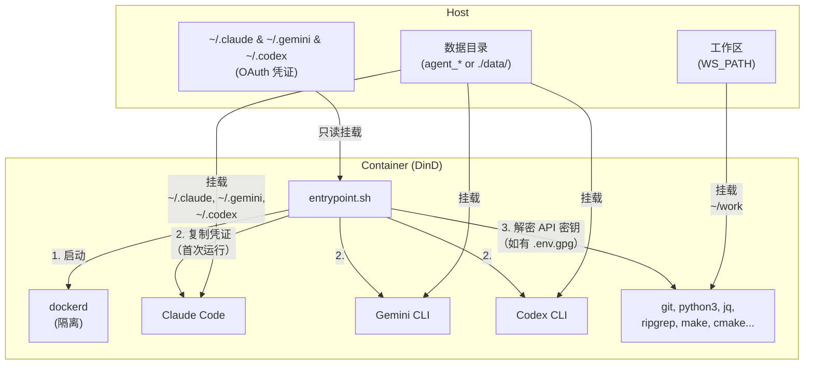
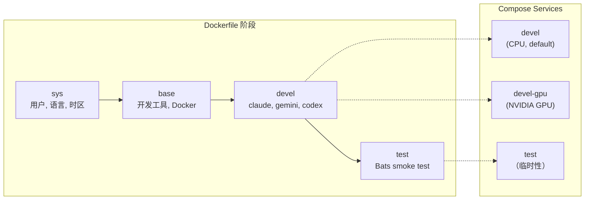
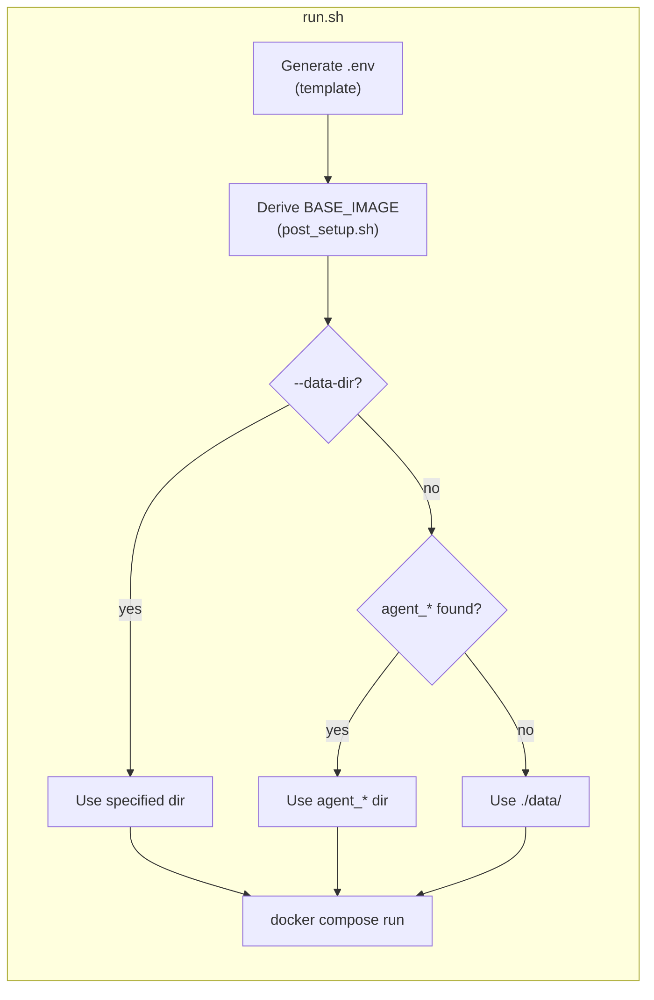

**[English](../README.md)** | **[繁體中文](README.zh-TW.md)** | **简体中文** | **[日本語](README.ja.md)**

# AI Agent 开发环境

[](https://github.com/ycpss91255-docker/ai_agent/actions/workflows/main.yaml) [](../LICENSE)

Docker-in-Docker (DinD) AI 代理开发容器，预装 Claude Code、Gemini CLI 与 OpenAI Codex CLI。提供 CPU 与 NVIDIA GPU 两种版本，以非 root 用户运行，并自动对应主机的 UID/GID。

## 目录

- [TL;DR](#tldr)
- [概览](#概览)
- [前置需求](#前置需求)
- [快速开始](#快速开始)
- [对话持久化](#对话持久化)
- [多实例运行](#多实例运行)
- [认证](#认证)
  - [OAuth（交互式登录）](#oauth交互式登录)
  - [API 密钥（加密）](#api-密钥加密)
- [作为 Subtree 使用](#作为-subtree-使用)
- [设置](#设置)
- [Smoke Tests](#smoke-tests)
- [架构](#架构)
  - [Dockerfile 构建阶段](#dockerfile-构建阶段)
  - [Compose 服务](#compose-服务)
  - [入口点流程](#入口点流程)
  - [预装工具](#预装工具)
  - [容器权限](#容器权限)

## TL;DR

```bash
./build.sh && ./run.sh    # 构建并启动（CPU，默认）
```

- 隔离的 Docker-in-Docker 容器，含 Claude Code + Gemini CLI + OpenAI Codex CLI
- 非 root 用户，自动从主机检测 UID/GID
- 首次运行时自动复制 OAuth 凭证，对话记录持久化保存于本地
- 可选择以 GPG AES-256 加密 API 密钥
- 默认为 CPU 版本，GPU 版本请使用 `./run.sh devel-gpu`

## 概览







## 前置需求

- Docker 含 Compose V2
- GPU 版本需要 [nvidia-container-toolkit](https://docs.nvidia.com/datacenter/cloud-native/container-toolkit/install-guide.html)
- 在主机端完成 Claude Code（`claude`）、Gemini CLI（`gemini`）及/或 Codex CLI（`codex`）的 OAuth 登录

## 快速开始

```bash
# 构建（每次执行时自动生成 .env）
./build.sh              # CPU 版本（默认）
./build.sh devel-gpu    # GPU 版本
./build.sh --no-env test  # 构建但不更新 .env

# 启动
./run.sh                          # CPU 版本（默认）
./run.sh devel-gpu                # GPU 版本
./run.sh --data-dir ../agent_foo  # 指定数据目录
./run.sh --no-env -d              # 后台启动，跳过 .env 更新

# 进入运行中的容器
./exec.sh
```

## 对话持久化

对话记录与 Session 数据通过 挂载 持久化保存，容器重启后仍可保留。

`run.sh` 会自动从项目目录向上扫描是否存在 `agent_*` 目录。若找到，则将数据存放于该目录；否则回退使用 `./data/`。

```
# 示例：若 ../agent_myproject/ 存在
../agent_myproject/
├── .claude/    # Claude Code 对话记录、设置、Session
├── .gemini/    # Gemini CLI 对话记录、设置、Session
└── .codex/     # Codex CLI 对话记录、设置、Session

# 回退方案：找不到 agent_* 目录
./data/
├── .claude/
├── .gemini/
└── .codex/
```

- 首次启动：OAuth 凭证从主机复制到数据目录
- 后续启动：数据目录已有数据，直接使用（不覆写）
- 可自由复制、备份或移动数据目录
- 手动覆盖：`./run.sh --data-dir /path/to/dir`

## 多实例运行

使用 `--project-name`（`-p`）创建完全隔离的实例，每个实例拥有独立的具名 Volume：

```bash
# 实例 1
docker compose -p ai1 --env-file .env run --rm devel

# 实例 2（另一个终端）
docker compose -p ai2 --env-file .env run --rm devel

# 实例 3
docker compose -p ai3 --env-file .env run --rm devel
```

若需多个实例，请创建各自独立的 `agent_*` 目录：

```bash
mkdir ../agent_proj1 ../agent_proj2

./run.sh --data-dir ../agent_proj1
./run.sh --data-dir ../agent_proj2
```

凭证、对话记录与 Session 数据完全隔离。清理时只需删除对应目录：

```bash
rm -rf ../agent_proj1
```

## 认证

支持两种方式，可同时使用。

### OAuth（交互式登录）

适用于交互式 CLI 使用。请先在主机端登录：

```bash
claude   # 登录 Claude Code
gemini   # 登录 Gemini CLI
codex    # 登录 Codex CLI
```

凭证（`~/.claude`、`~/.gemini`、`~/.codex`）以只读方式挂载至容器，并在首次启动时复制至数据目录。后续启动直接沿用既有数据。

### API 密钥（加密）

适用于程序化 API 访问。密钥以 GPG（AES-256）加密存储，绝不以明文保存。

```bash
# 1. 创建明文 .env
cat <<EOF > .env.keys
ANTHROPIC_API_KEY=sk-ant-xxxxx
GEMINI_API_KEY=xxxxx
OPENAI_API_KEY=sk-xxxxx
EOF

# 2. 加密（系统会提示设置口令）
encrypt_env.sh    # 在容器内可用，或在主机端执行 ./encrypt_env.sh

# 3. 删除明文文件
rm .env.keys
```

容器启动时，若在工作区检测到 `.env.gpg`，系统会提示输入口令。解密后的密钥仅以环境变量形式保存于内存中。

> **注意：**`.env` 与 `.env.gpg` 已列于 `.gitignore`。

## 作为 Subtree 使用

此 repo 可通过 `git subtree` 嵌入至其他项目，让项目自带 Docker 开发环境。

### 添加到你的项目

```bash
git subtree add --prefix=docker/ai_agent \
    https://github.com/ycpss91255-docker/ai_agent.git main --squash
```

添加后的目录结构示例：

```text
my_project/
├── src/                         # 项目源代码
├── docker/ai_agent/             # Subtree
│   ├── build.sh
│   ├── run.sh
│   ├── compose.yaml
│   ├── Dockerfile
│   └── template/
└── ...
```

### 构建与运行

```bash
cd docker/ai_agent
./build.sh && ./run.sh
```

`build.sh` 内部使用 `--base-path`，因此无论从何处执行，路径检测都能正确工作。

### 工作区检测行为

<details>
<summary>展开查看作为 subtree 使用时的检测行为</summary>

当 subtree 位于 `my_project/docker/ai_agent/` 时：

- **IMAGE_NAME**：目录名称为 `ai_agent`（非 `docker_*`），因此检测会回退至 `.env.example`，其中设置了 `IMAGE_NAME=ai_agent` — 可正常工作。
- **WS_PATH**：策略 1（同层扫描）与策略 2（向上遍历）可能无法匹配，因此策略 3（回退）会解析至上层目录（`my_project/docker/`）。

**建议**：首次构建后，请编辑 `.env` 中的 `WS_PATH` 指向实际工作区。此值在后续构建中会被保留。

</details>

### 同步上游更新

```bash
git subtree pull --prefix=docker/ai_agent \
    https://github.com/ycpss91255-docker/ai_agent.git main --squash
```

> **注意事项**：
> - 本地修改会由 git 正常跟踪。
> - 若上游修改了与你本地相同的文件，`subtree pull` 可能会产生合并冲突。
> - **不要**修改 subtree 内的 `template/` — 它由 env repo 自身的 subtree 管理。

## 设置

每次执行 `build.sh` / `run.sh` 时会自动生成 `.env`（可传入 `--no-env` 跳过）。详见 [.env.example](.env.example)。

| 变量 | 说明 |
|------|------|
| `USER_NAME` / `USER_UID` / `USER_GID` | 对应主机的容器用户（自动检测） |
| `GPU_ENABLED` | 自动检测，决定 `BASE_IMAGE` 与 `GPU_VARIANT` |
| `BASE_IMAGE` | `node:20-slim`（CPU）或 `nvidia/cuda:13.1.1-cudnn-devel-ubuntu24.04`（GPU） |
| `WS_PATH` | 挂载至容器内 `~/work` 的主机路径 |
| `IMAGE_NAME` | Docker 镜像名称（默认：`ai_agent`） |

## Smoke Tests

详见 [TEST.md](../test/TEST.md)。

## 架构

```
.
├── Dockerfile             # 多阶段构建（sys → base → devel → test）
├── compose.yaml           # 服务：devel（CPU）、devel-gpu、test
├── build.sh               # 含自动 .env 生成的构建脚本
├── run.sh                 # 含自动 .env 生成的启动脚本
├── exec.sh                # 进入运行中容器
├── entrypoint.sh          # DinD 启动、OAuth 复制、API 密钥解密
├── encrypt_env.sh         # API 密钥加密辅助脚本
├── post_setup.sh          # 依 GPU_ENABLED 推导 BASE_IMAGE
├── .env.example           # .env 模板
├── smoke/            # Bats smoke test
│   ├── agent_env.bats
│   └── test_helper.bash
├── template/   # 自动 .env 生成器（git subtree）
├── README.md
└── README.zh-TW.md
```

### Dockerfile 构建阶段

| 阶段 | 用途 |
|------|------|
| `sys` | 创建用户/群组、语言环境、时区、Node.js（仅 GPU） |
| `base` | 开发工具、Python、构建工具、Docker、jq、ripgrep |
| `devel` | Claude Code、Gemini CLI、Codex CLI、入口点、切换至非 root 用户 |
| `test` | Bats smoke test（临时性，验证后即弃用） |

### Compose 服务

| 服务 | 说明 |
|------|------|
| `devel` | CPU 版本（默认） |
| `devel-gpu` | GPU 版本，含 NVIDIA 设备保留 |
| `test` | smoke test（以 profile 控制） |

### 入口点流程

1. 通过 sudo 启动 `dockerd`（DinD），等待就绪（最多 30 秒）
2. 将 OAuth 凭证从只读挂载点复制至 `data/` 目录（仅首次运行）
3. 解密 `.env.gpg` 并将 API 密钥导出为环境变量（若存在）
4. 执行 CMD（`bash`）

### 预装工具

| 工具 | 用途 |
|------|------|
| Claude Code | Anthropic AI CLI |
| Gemini CLI | Google AI CLI |
| Codex CLI | OpenAI AI CLI |
| Docker (DinD) | 容器内的隔离 Docker daemon |
| Node.js 20 | CLI 工具执行环境 |
| Python 3 | 脚本编写与开发 |
| git, curl, wget | 版本控制与下载 |
| jq, ripgrep | JSON 处理与代码搜索 |
| make, g++, cmake | 构建工具链 |
| tree | 目录可视化 |

GPU 版本额外包含：CUDA 13.1.1、cuDNN、OpenCL、Vulkan。

### 容器权限

两个服务均需要 `SYS_ADMIN`、`NET_ADMIN`、`MKNOD` 权限，并设置 `seccomp:unconfined`，以确保 DinD 正常运作。内部 Docker daemon 与主机完全隔离。
