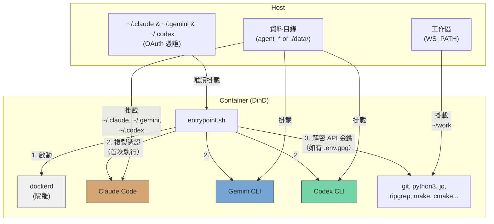
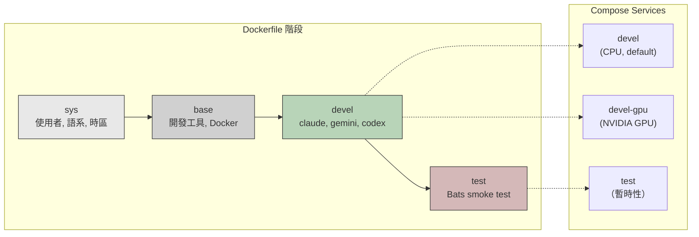
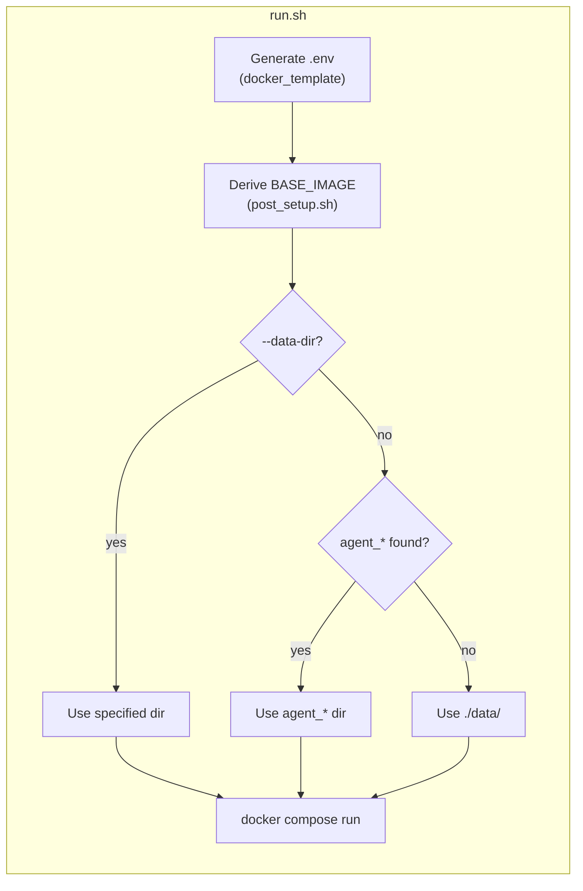

**[English](../README.md)** | **繁體中文** | **[简体中文](README.zh-CN.md)** | **[日本語](README.ja.md)**

# AI Agent 開發環境

Docker-in-Docker (DinD) AI 代理開發容器，預裝 Claude Code、Gemini CLI 與 OpenAI Codex CLI。提供 CPU 與 NVIDIA GPU 兩種版本，以非 root 用戶運行，並自動對應主機的 UID/GID。

## 目錄

- [TL;DR](#tldr)
- [概覽](#概覽)
- [前置需求](#前置需求)
- [快速開始](#快速開始)
- [對話持久化](#對話持久化)
- [多實例運行](#多實例運行)
- [認證](#認證)
  - [OAuth（互動式登入）](#oauth互動式登入)
  - [API 金鑰（加密）](#api-金鑰加密)
- [作為 Subtree 使用](#作為-subtree-使用)
- [設定](#設定)
- [smoke test](#smoke test)
- [架構](#架構)
  - [Dockerfile 建置階段](#dockerfile-建置階段)
  - [Compose 服務](#compose-服務)
  - [進入點流程](#進入點流程)
  - [預裝工具](#預裝工具)
  - [容器權限](#容器權限)

## TL;DR

```bash
./build.sh && ./run.sh    # 建置並啟動（CPU，預設）
```

- 隔離的 Docker-in-Docker 容器，含 Claude Code + Gemini CLI + OpenAI Codex CLI
- 非 root 用戶，自動從主機偵測 UID/GID
- 首次運行時自動複製 OAuth 憑證，對話記錄持久化保存於本地
- 可選擇以 GPG AES-256 加密 API 金鑰
- 預設為 CPU 版本，GPU 版本請使用 `./run.sh devel-gpu`

## 概覽







## 前置需求

- Docker 含 Compose V2
- GPU 版本需要 [nvidia-container-toolkit](https://docs.nvidia.com/datacenter/cloud-native/container-toolkit/install-guide.html)
- 在主機端完成 Claude Code（`claude`）、Gemini CLI（`gemini`）及/或 Codex CLI（`codex`）的 OAuth 登入

## 快速開始

```bash
# 建置（每次執行時自動產生 .env）
./build.sh              # CPU 版本（預設）
./build.sh devel-gpu    # GPU 版本
./build.sh --no-env test  # 建置但不更新 .env

# 啟動
./run.sh                          # CPU 版本（預設）
./run.sh devel-gpu                # GPU 版本
./run.sh --data-dir ../agent_foo  # 指定資料目錄
./run.sh --no-env -d              # 背景啟動，跳過 .env 更新

# 進入運行中的容器
./exec.sh
```

## 對話持久化

對話記錄與 Session 資料透過 掛載 持久化保存，容器重啟後仍可保留。

`run.sh` 會自動從專案目錄向上掃描是否存在 `agent_*` 目錄。若找到，則將資料存放於該目錄；否則退回使用 `./data/`。

```
# 範例：若 ../agent_myproject/ 存在
../agent_myproject/
├── .claude/    # Claude Code 對話記錄、設定、Session
├── .gemini/    # Gemini CLI 對話記錄、設定、Session
└── .codex/     # Codex CLI 對話記錄、設定、Session

# 退回方案：找不到 agent_* 目錄
./data/
├── .claude/
├── .gemini/
└── .codex/
```

- 首次啟動：OAuth 憑證從主機複製到資料目錄
- 後續啟動：資料目錄已有資料，直接使用（不覆寫）
- 可自由複製、備份或移動資料目錄
- 手動覆蓋：`./run.sh --data-dir /path/to/dir`

## 多實例運行

使用 `--project-name`（`-p`）建立完全隔離的實例，每個實例擁有獨立的具名 Volume：

```bash
# 實例 1
docker compose -p ai1 --env-file .env run --rm devel

# 實例 2（另一個終端機）
docker compose -p ai2 --env-file .env run --rm devel

# 實例 3
docker compose -p ai3 --env-file .env run --rm devel
```

若需多個實例，請建立各自獨立的 `agent_*` 目錄：

```bash
mkdir ../agent_proj1 ../agent_proj2

./run.sh --data-dir ../agent_proj1
./run.sh --data-dir ../agent_proj2
```

憑證、對話記錄與 Session 資料完全隔離。清理時只需刪除對應目錄：

```bash
rm -rf ../agent_proj1
```

## 認證

支援兩種方式，可同時使用。

### OAuth（互動式登入）

適用於互動式 CLI 使用。請先在主機端登入：

```bash
claude   # 登入 Claude Code
gemini   # 登入 Gemini CLI
codex    # 登入 Codex CLI
```

憑證（`~/.claude`、`~/.gemini`、`~/.codex`）以唯讀方式掛載至容器，並在首次啟動時複製至資料目錄。後續啟動直接沿用既有資料。

### API 金鑰（加密）

適用於程式化 API 存取。金鑰以 GPG（AES-256）加密儲存，絕不以明文保存。

```bash
# 1. 建立明文 .env
cat <<EOF > .env.keys
ANTHROPIC_API_KEY=sk-ant-xxxxx
GEMINI_API_KEY=xxxxx
OPENAI_API_KEY=sk-xxxxx
EOF

# 2. 加密（系統會提示設定通關密語）
encrypt_env.sh    # 在容器內可用，或在主機端執行 ./encrypt_env.sh

# 3. 刪除明文檔案
rm .env.keys
```

容器啟動時，若在工作區偵測到 `.env.gpg`，系統會提示輸入通關密語。解密後的金鑰僅以環境變數形式保存於記憶體中。

> **注意：**`.env` 與 `.env.gpg` 已列於 `.gitignore`。

## 作為 Subtree 使用

此 repo 可透過 `git subtree` 嵌入至其他專案，讓專案自帶 Docker 開發環境。

### 加入你的專案

```bash
git subtree add --prefix=docker/ai_agent \
    https://github.com/ycpss91255-docker/ai_agent.git main --squash
```

加入後的目錄結構範例：

```text
my_project/
├── src/                         # 專案原始碼
├── docker/ai_agent/             # Subtree
│   ├── build.sh
│   ├── run.sh
│   ├── compose.yaml
│   ├── Dockerfile
│   └── docker_template/
└── ...
```

### 建置與執行

```bash
cd docker/ai_agent
./build.sh && ./run.sh
```

`build.sh` 內部使用 `--base-path`，因此無論從何處執行，路徑偵測都能正確運作。

### 工作區偵測行為

<details>
<summary>展開查看作為 subtree 使用時的偵測行為</summary>

當 subtree 位於 `my_project/docker/ai_agent/` 時：

- **IMAGE_NAME**：目錄名稱為 `ai_agent`（非 `docker_*`），因此偵測會退回至 `.env.example`，其中設定了 `IMAGE_NAME=ai_agent` — 可正常運作。
- **WS_PATH**：策略 1（同層掃描）與策略 2（向上遍歷）可能無法匹配，因此策略 3（退回）會解析至上層目錄（`my_project/docker/`）。

**建議**：首次建置後，請編輯 `.env` 中的 `WS_PATH` 指向實際工作區。此值在後續建置中會被保留。

</details>

### 同步上游更新

```bash
git subtree pull --prefix=docker/ai_agent \
    https://github.com/ycpss91255-docker/ai_agent.git main --squash
```

> **注意事項**：
> - 本地修改會由 git 正常追蹤。
> - 若上游修改了與你本地相同的檔案，`subtree pull` 可能會產生合併衝突。
> - **不要**修改 subtree 內的 `docker_template/` — 它由 env repo 自身的 subtree 管理。

## 設定

每次執行 `build.sh` / `run.sh` 時會自動產生 `.env`（可傳入 `--no-env` 跳過）。詳見 [.env.example](.env.example)。

| 變數 | 說明 |
|------|------|
| `USER_NAME` / `USER_UID` / `USER_GID` | 對應主機的容器用戶（自動偵測） |
| `GPU_ENABLED` | 自動偵測，決定 `BASE_IMAGE` 與 `GPU_VARIANT` |
| `BASE_IMAGE` | `node:20-slim`（CPU）或 `nvidia/cuda:13.1.1-cudnn-devel-ubuntu24.04`（GPU） |
| `WS_PATH` | 掛載至容器內 `~/work` 的主機路徑 |
| `IMAGE_NAME` | Docker 映像名稱（預設：`ai_agent`） |

## smoke test

建置 test target 驗證環境：

```bash
./build.sh test
```

位於 `smoke_test/agent_env.bats`，共 **29** 項。

<details>
<summary>展開查看測試細項</summary>

#### AI 工具 (3)

| 測試項目 | 說明 |
|----------|------|
| `claude` | 可用 |
| `gemini` | 可用 |
| `codex` | 可用 |

#### 開發工具 (14)

| 測試項目 | 說明 |
|----------|------|
| `node` | 可用 |
| `npm` | 可用 |
| `git` | 可用 |
| `python3` | 可用 |
| `make` | 可用 |
| `cmake` | 可用 |
| `g++` | 可用 |
| `curl` | 可用 |
| `wget` | 可用 |
| `jq` | 可用 |
| `rg` (ripgrep) | 可用 |
| `tree` | 可用 |
| `docker` | 可用 |
| `gpg` | 可用 |

#### 系統 (7)

| 測試項目 | 說明 |
|----------|------|
| 用戶 | 非 root |
| `sudo` | 免密碼執行 |
| 時區 | `Asia/Taipei` |
| `LANG` | `en_US.UTF-8` |
| work 目錄 | 存在 |
| work 目錄 | 可寫入 |
| `entrypoint.sh` | 存在 |

#### 排除工具 (4)

| 測試項目 | 說明 |
|----------|------|
| `tmux` | 未安裝（最小化映像） |
| `vim` | 未安裝 |
| `fzf` | 未安裝 |
| `terminator` | 未安裝 |

#### 安全性 (1)

| 測試項目 | 說明 |
|----------|------|
| `encrypt_env.sh` | 在 PATH 中 |

</details>

## 架構

```
.
├── Dockerfile             # 多階段建置（sys → base → devel → test）
├── compose.yaml           # 服務：devel（CPU）、devel-gpu、test
├── build.sh               # 含自動 .env 產生的建置腳本
├── run.sh                 # 含自動 .env 產生的啟動腳本
├── exec.sh                # 進入運行中容器
├── entrypoint.sh          # DinD 啟動、OAuth 複製、API 金鑰解密
├── encrypt_env.sh         # API 金鑰加密輔助腳本
├── post_setup.sh          # 依 GPU_ENABLED 推導 BASE_IMAGE
├── .env.example           # .env 範本
├── smoke_test/            # Bats smoke test
│   ├── agent_env.bats
│   └── test_helper.bash
├── docker_template/   # 自動 .env 產生器（git subtree）
├── README.md
└── README.zh-TW.md
```

### Dockerfile 建置階段

| 階段 | 用途 |
|------|------|
| `sys` | 建立用戶/群組、語系、時區、Node.js（僅 GPU） |
| `base` | 開發工具、Python、建置工具、Docker、jq、ripgrep |
| `devel` | Claude Code、Gemini CLI、Codex CLI、進入點、切換至非 root 用戶 |
| `test` | Bats smoke test（暫時性，驗證後即棄用） |

### Compose 服務

| 服務 | 說明 |
|------|------|
| `devel` | CPU 版本（預設） |
| `devel-gpu` | GPU 版本，含 NVIDIA 裝置保留 |
| `test` | smoke test（以 profile 控制） |

### 進入點流程

1. 透過 sudo 啟動 `dockerd`（DinD），等待就緒（最多 30 秒）
2. 將 OAuth 憑證從唯讀掛載點複製至 `data/` 目錄（僅首次運行）
3. 解密 `.env.gpg` 並將 API 金鑰匯出為環境變數（若存在）
4. 執行 CMD（`bash`）

### 預裝工具

| 工具 | 用途 |
|------|------|
| Claude Code | Anthropic AI CLI |
| Gemini CLI | Google AI CLI |
| Codex CLI | OpenAI AI CLI |
| Docker (DinD) | 容器內的隔離 Docker daemon |
| Node.js 20 | CLI 工具執行環境 |
| Python 3 | 腳本撰寫與開發 |
| git, curl, wget | 版本控制與下載 |
| jq, ripgrep | JSON 處理與程式碼搜尋 |
| make, g++, cmake | 建置工具鏈 |
| tree | 目錄視覺化 |

GPU 版本額外包含：CUDA 13.1.1、cuDNN、OpenCL、Vulkan。

### 容器權限

兩個服務均需要 `SYS_ADMIN`、`NET_ADMIN`、`MKNOD` 權限，並設定 `seccomp:unconfined`，以確保 DinD 正常運作。內部 Docker daemon 與主機完全隔離。
